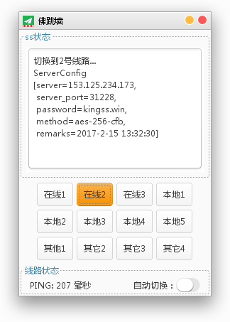
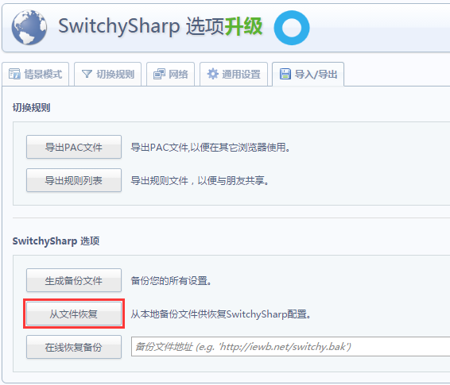
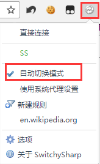

# JavaSwingSoftwares
这是我自己编写的一系列基于Java Swing的桌面应用，开箱即用，简单便捷。  
请注意，使用前需要安装JDK8运行环境。  
JDK8的下载地址为：http://www.oracle.com/technetwork/java/javase/downloads/jdk8-downloads-2133151.html   
若有疑问或建议，请邮件我，我的邮箱是:  lnwazg@126.com  
QQ： 914096874  

## 1. AutoShadow 基于java swing的翻墙工具
这款小工具可以帮助你有效地翻墙。软件运行截图如下:  

### 使用步骤：  
1. 下载并安装jdk8  
2. 下载AutoShadow文件夹内的AutoShadow-1.1.jar，双击打开  
3. 然后点击软件的“在线1”或者“在线2”或者“在线3”按钮，如果线路可用，则软件的任务栏图标将显示为绿色的，否则为红色的。绿色状态下可以正常翻墙，红色状态下无法翻墙。  
4. 打开chrome浏览器，在地址栏输入  chrome://extensions/  
5. 将附件里的SwitchySharp.crx拖入到你的扩展程序里，并安装
6. 打开SwitchySharp的配置选项，点击“从文件恢复”，选择附件里下载的SwitchyOptions.bak，导入即可   
   
7. 点击浏览器右上角的插件，下拉选择“自动切换模式”，然后尽情享用吧。   
    
8. 打开https://www.youtube.com/ 检测一下你是否可以正常翻墙。如果可以正常打开，说明已经翻墙成功了，have fun！  
    

## 2. CACHE_SERVER  纯java的类redis缓存服务器  
这款缓存服务器可以让你方便地存储任意的键值对到本地磁盘中，api高仿redis，使用轻巧方便，可以自定义端口号，双击即可使用。  
运行截图如下：  

提供的基本功能：  
put(Serializable key, Serializable value)     将任意键值对放入到redis缓存   
get(Serializable key, Class<T> classType)     根据key取出相对应的缓存对象，并将结果转换为指定的类型  
get(Serializable key)                         根据key取出相对应的缓存对象                
remove(Serializable key)                      移除掉某个key  
incr(Serializable key)						  将某个key对应的对象的值+1  
decr(Serializable key)                        将某个key对应的对象的值-1  

